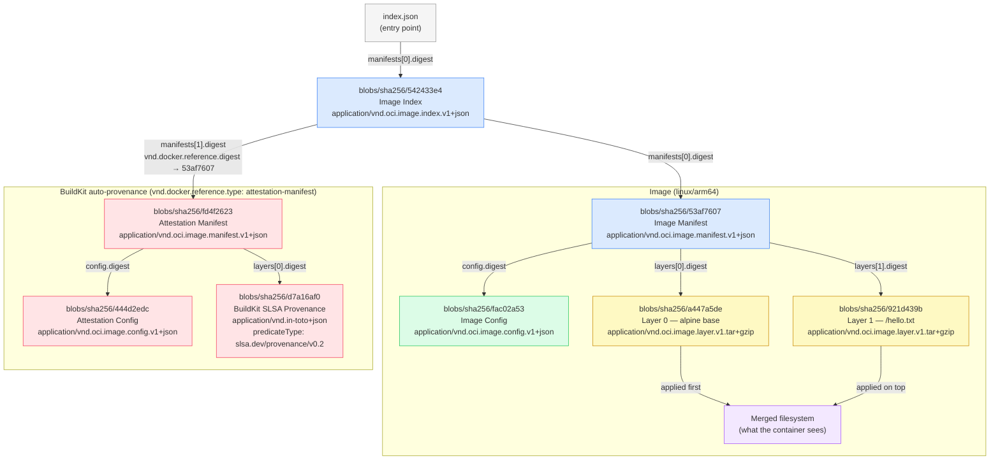

# OCI Image structure

> Spec reference: [OCI Image Layout Specification](https://github.com/opencontainers/image-spec/blob/main/image-layout.md)

An OCI image saved with `docker save` is a tar archive that follows the
[OCI Image Layout](https://github.com/opencontainers/image-spec/blob/main/image-layout.md) format.
Everything inside is content-addressed: files are stored as blobs named by their SHA-256 digest.

---

## Step 1 — OCI images are just tarballs

```bash
cd step1-basic

# Build the image
docker build -f Containerfile -t oci-demo:step1 .

# Run it to verify it works
docker run --rm oci-demo:step1
```

Now export the image to a tar archive:

```bash
mkdir -p tmp
docker save oci-demo:step1 -o ./tmp/step1.tar

# Look at what's inside
tar tf ./tmp/step1.tar
```

### Archive layout

After running the commands you get 

```
tmp/layer-inspect/
├── oci-layout                        # layout version marker
├── index.json                        # entry point — the image index
├── manifest.json                     # legacy Docker compatibility manifest
└── blobs/
    └── sha256/
        ├── 542433e4…   (index)       # OCI image index for this tag
        ├── fac02a53…   (config)      # image configuration JSON
        ├── a447a5de…   (layer tar)   # layer 0 — alpine base rootfs
        └── 921d439b…   (layer tar)   # layer 1 — our RUN instruction
```

---

### File by file

#### `oci-layout`

Marks the directory as an OCI Image Layout and states the spec version.

```json
{"imageLayoutVersion": "1.0.0"}
```

#### `index.json`

The top-level entry point.
It is an [Image Index](https://github.com/opencontainers/image-spec/blob/main/image-index.md)
(a.k.a. manifest list) that maps tag names to image manifests via content digests.

```json
{
  "schemaVersion": 2,
  "mediaType": "application/vnd.oci.image.index.v1+json",
  "manifests": [
    {
      "mediaType": "application/vnd.oci.image.index.v1+json",
      "digest": "sha256:542433e4…",
      "size": 855,
      "annotations": {
        "org.opencontainers.image.ref.name": "step1"
      }
    }
  ]
}
```

The digest `sha256:542433e4…` is the filename of the next blob to follow.

#### `manifest.json`

A legacy Docker-format manifest added by `docker save` for backwards compatibility with older tooling. Not part of the OCI spec — you can ignore it when reading the image spec.

```json
[{
  "Config":   "blobs/sha256/fac02a53…",
  "RepoTags": ["oci-demo:step1"],
  "Layers":   ["blobs/sha256/a447a5de…", "blobs/sha256/921d439b…"]
}]
```

#### `blobs/sha256/542433e4…` — the OCI Image Manifest

> Spec: [image-manifest.md](https://github.com/opencontainers/image-spec/blob/main/manifest.md)

Points to the config blob and the ordered list of layer blobs for a specific platform.

```json
{
  "schemaVersion": 2,
  "mediaType": "application/vnd.oci.image.manifest.v1+json",
  "config": {
    "mediaType": "application/vnd.oci.image.config.v1+json",
    "digest": "sha256:fac02a53…",
    "size": 1234
  },
  "layers": [
    { "mediaType": "application/vnd.oci.image.layer.v1.tar+gzip", "digest": "sha256:a447a5de…" },
    { "mediaType": "application/vnd.oci.image.layer.v1.tar+gzip", "digest": "sha256:921d439b…" }
  ]
}
```

#### `blobs/sha256/fac02a53…` — the Image Config

> Spec: [config.md](https://github.com/opencontainers/image-spec/blob/main/config.md)

The image configuration JSON. Contains:

| Field | What it stores |
|---|---|
| `config.Env` | Environment variables (`ENV` instructions) |
| `config.Cmd` | Default command (`CMD` instruction) |
| `config.Entrypoint` | Entrypoint (`ENTRYPOINT` instruction) |
| `rootfs.diff_ids` | Ordered list of **uncompressed** layer digests (DiffIDs) |
| `history` | Full build history — one entry per Dockerfile instruction |

```json
{
  "architecture": "arm64",
  "os": "linux",
  "config": {
    "Env": ["PATH=/usr/local/sbin:…"],
    "Cmd": ["cat", "/hello.txt"]
  },
  "rootfs": {
    "type": "layers",
    "diff_ids": [
      "sha256:6d6d5227…",
      "sha256:6eb80f89…"
    ]
  },
  "history": [
    { "created_by": "ADD alpine-minirootfs-3.21.6-aarch64.tar.gz / # buildkit" },
    { "created_by": "CMD [\"/bin/sh\"]", "empty_layer": true },
    { "created_by": "RUN /bin/sh -c echo \"Hello, OCI World!\" > /hello.txt" },
    { "created_by": "CMD [\"cat\" \"/hello.txt\"]", "empty_layer": true }
  ]
}
```

Note: `empty_layer: true` means the instruction (like `CMD` or `ENV`) produced no filesystem
change and therefore has no corresponding entry in `rootfs.diff_ids`.

The **ImageID** is simply the SHA-256 of this JSON document — because it references the digests
of all layers, the ID is fully content-addressed and tamper-evident.

#### `blobs/sha256/a447a5de…` and `blobs/sha256/921d439b…` — Layer tarballs

Each layer is a tar archive of the filesystem delta for that build step.

- Layer 0 (`a447a5de`) — the Alpine base image rootfs (`/bin`, `/etc`, `/lib`, …)
- Layer 1 (`921d439b`) — only the single file added by our `RUN` instruction: `/hello.txt`

The layers are applied in order on top of each other using a union filesystem (OverlayFS).
The result is the merged filesystem the container sees at runtime.

---

### How it all connects



Every arrow is a `digest` field — a cryptographic hash of the blob's contents.
Changing any file changes its digest, which changes every blob that references it,
which changes the ImageID. The entire image is a Merkle tree.

## Step 2 - Inspect each layer individually

```bash
mkdir -p tmp/layer-inspect
tar xf ./tmp/step1.tar -C tmp/layer-inspect
ls tmp/layer-inspect

# In OCI layout, blobs have no extension — use manifest.json to find layer digests
# Each layer blob is a gzipped tar named only by its sha256 digest
cat tmp/layer-inspect/manifest.json | jq -r '.[0].Layers[]' | while read layer_path; do
  digest="${layer_path##*/}"
  dest="tmp/layer-inspect/blobs/sha256/${digest}-rootfs"
  mkdir -p "$dest"
  tar xzf "tmp/layer-inspect/$layer_path" -C "$dest"
  echo "=== $digest ==="
  ls "$dest"
done
```


## Step 2 - Inspect the merged filesystem with the workbench


Use the hardening workbench to merge all layers into one directory:

```bash
container-hardening-work-bench inspect -f Containerfile -o ./tmp/merged
ls ./tmp/merged   # this is exactly what the container sees at runtime
```

./merged is the result of applying all layers on top of each other. This is exactly what the container sees at runtime — the union of all layers with whiteouts already resolved. You can `ls`, `cat`, and even `diff` this directory to explore the final filesystem.